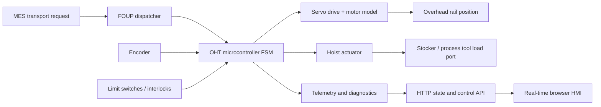

# AMHS FOUP Digital Twin

A discrete-event simulation of an **Automated Material Handling System (AMHS)**
for transporting 300 mm wafer FOUPs through a semiconductor fab. The project
connects factory scheduling with the controls concepts behind an overhead hoist
transport (OHT): servo drives, actuator sequencing, sensor interlocks, and
microcontroller-style state machines.

The project includes a real-time browser control room that animates OHT motion,
FOUP transfers, servo telemetry, dispatch activity, and safety interlocks.

## What this demonstrates

- **Robotics:** motion planning between stockers and process tools
- **Drives:** closed-loop velocity command with acceleration and speed limits
- **Actuators:** timed hoist transfer with completion/limit-switch semantics
- **Embedded control:** deterministic finite-state machine and emergency stop
- **Manufacturing software:** FOUP dispatch queue, station routing, and telemetry
- **Software engineering:** typed Python, unit tests, packaging, and GitHub CI
- **HMI/digital twin:** live HTTP telemetry, animated plant view, and fault injection

## Live control-room dashboard

```bash
python -m amhs_sim.web
```

Then open [http://127.0.0.1:8080](http://127.0.0.1:8080). The dashboard supports
1×/2×/4× plant time, pause/resume, scenario reset, and per-vehicle emergency-stop
injection. It runs entirely on the Python standard library.

## System architecture



See the [complete systems drawing](docs/system-architecture.md) for the fab
control hierarchy, data flow, safety feedback, and controller state model.

The controller follows this sequence:

`IDLE → TO_PICKUP → PICKING → TO_DROPOFF → DROPPING → IDLE`

Any interlock can transition the controller to `FAULT`; reset returns it to a
safe recovery state with motor torque and hoist motion removed.

## Run it

Requires Python 3.10+ and no third-party runtime dependencies.

```bash
python -m amhs_sim.cli
python -m amhs_sim.cli --telemetry telemetry.csv
python -m unittest discover -s tests -v
```

Example result:

```json
{
  "elapsed_s": 31.6,
  "jobs_completed": 3,
  "jobs_queued": 0
}
```

## Engineering model

The OHT uses a proportional position-to-velocity loop:

`v_cmd = clamp(Kp × position_error, -v_max, v_max)`

The simulated drive then applies an acceleration limit before integrating
velocity into rail position. Arrival uses position tolerance plus target-crossing
detection. At a station, the MCU commands the hoist and waits for its completion
signal before advancing the state machine. These simplifications preserve the
important control boundaries while keeping the model readable.

## Roadmap

- Collision avoidance and rail-segment reservations
- MQTT/OPC UA telemetry adapter
- STM32/FreeRTOS reference firmware for the OHT controller
- Dispatch policy comparison (FIFO, nearest-vehicle, priority lots)

## Resume bullet

> Built a Python digital twin of semiconductor-fab AMHS operations, modeling
> FOUP dispatch, multi-vehicle OHT motion, acceleration-limited servo control,
> hoist actuator sequencing, safety interlocks, live browser HMI, fault injection,
> telemetry, automated tests, and CI.
