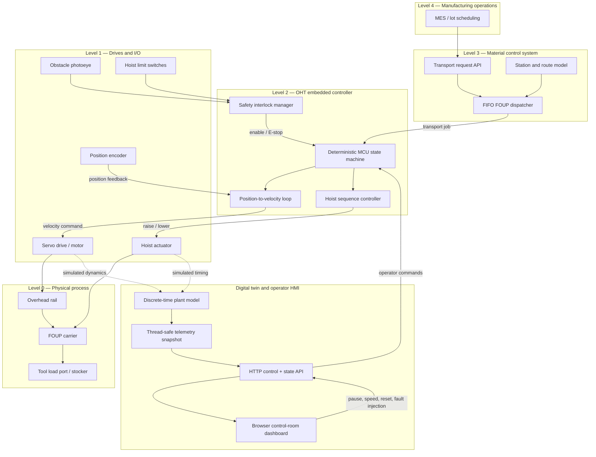
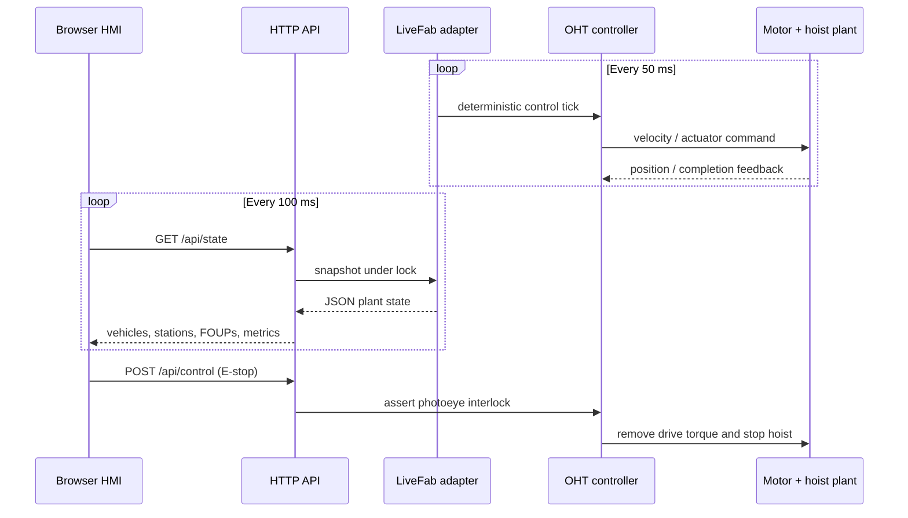
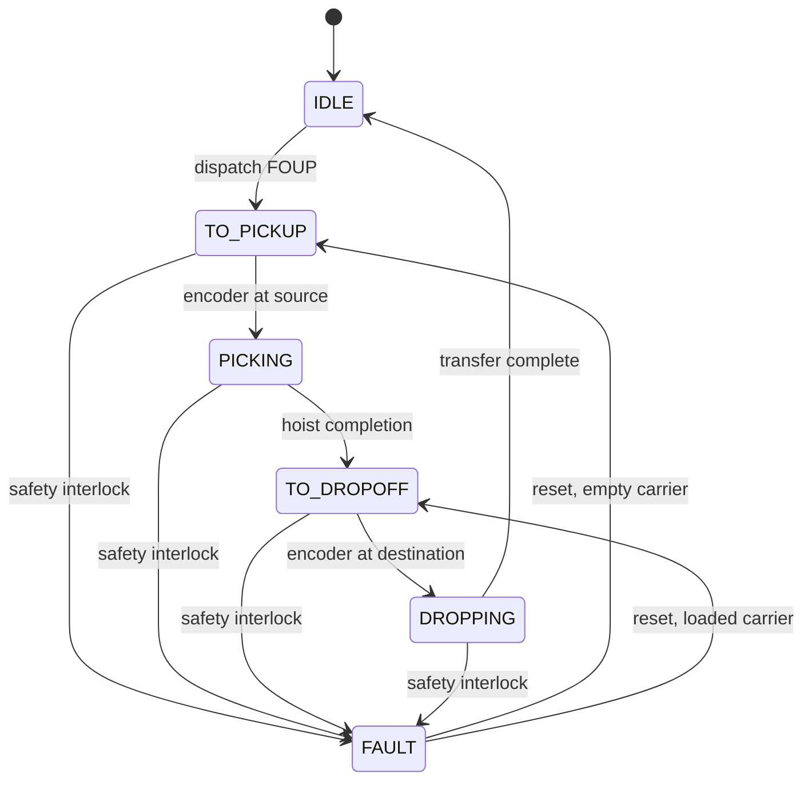

# AMHS system architecture

This drawing separates the fab-level software, OHT embedded controller, physical
plant, and real-time digital-twin interface. The simulator preserves the same
command, feedback, and safety boundaries used in an industrial AMHS.

## Runtime data flow

## Control-state model

## Design choices

- The simulation tick is deterministic and independent from browser polling.
- `LiveFab` is the synchronization boundary between plant state and HTTP threads.
- The dashboard has no third-party runtime dependencies; Python serves static
  assets and JSON using the standard library.
- Fault injection uses the same controller transition as a physical photoeye
  interlock, so the visualization exercises actual control logic rather than a
  cosmetic animation state.
